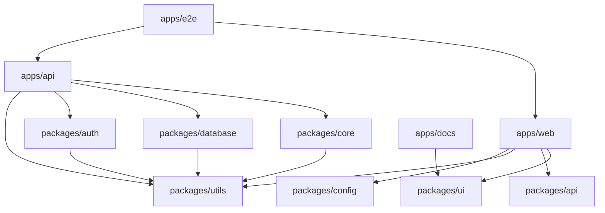

# 🚀 Quick Reference Guide

> **Fast lookup for where to find and place code in the Conduit Portfolio monorepo**

## 🎯 **Where do I put...?**

| What you're adding | Where it goes | Example |
|-------------------|---------------|---------|
| **New React component** | `packages/ui/src/` | Button, Modal, Form |
| **New API endpoint** | `apps/api/src/routes/` | `/api/articles`, `/api/auth` |
| **Frontend page** | `apps/web/src/app/` | `/login`, `/profile`, `/editor` |
| **Database schema** | `packages/database/src/schema/` | User table, Article table |
| **Business logic** | `packages/core/src/` | Article creation, User validation |
| **Utility function** | `packages/utils/src/` | Date formatting, Validation helpers |
| **Authentication logic** | `packages/auth/src/` | JWT handling, Password hashing |
| **Build script** | `tools/scripts/` | Database setup, Environment config |
| **Component story** | `apps/docs/stories/` | Button.stories.tsx |
| **E2E test** | `apps/e2e/cypress/e2e/` | Login flow, Article creation |
| **Documentation** | `docs/` | Architecture diagrams, API docs |
| **Infrastructure** | `infrastructure/` | Docker, Kubernetes, Terraform |

## 🔍 **Where do I find...?**

| What you're looking for | Where to look | Notes |
|------------------------|---------------|--------|
| **Existing components** | `packages/ui/src/` | All reusable UI components |
| **API types** | `packages/api/src/types/` | tRPC router types, request/response schemas |
| **Database models** | `packages/database/src/schema/` | Drizzle schemas and relations |
| **Validation schemas** | `packages/utils/src/validation/` | Zod schemas for validation |
| **Configuration files** | `packages/config/` | ESLint, Prettier, TypeScript configs |
| **Frontend pages** | `apps/web/src/app/` | Next.js App Router pages |
| **API routes** | `apps/api/src/routes/` | tRPC routers and endpoints |
| **Component documentation** | `apps/docs/` | Storybook stories and docs |
| **Test files** | `apps/e2e/cypress/` | End-to-end test scenarios |

## 📋 **Common Tasks**

### Adding a New Component
```bash
# 1. Create component in UI package
packages/ui/src/components/MyComponent.tsx

# 2. Export from UI package
packages/ui/src/index.ts

# 3. Create story (optional)
apps/docs/stories/MyComponent.stories.tsx

# 4. Use in frontend
apps/web/src/components/SomeFeature.tsx
```

### Adding a New API Endpoint
```bash
# 1. Define route in API app
apps/api/src/routes/myRouter.ts

# 2. Add types to API package
packages/api/src/types/MyTypes.ts

# 3. Add validation schema
packages/utils/src/validation/mySchema.ts

# 4. Use in frontend
apps/web/src/lib/api/myApi.ts
```

### Adding Business Logic
```bash
# 1. Define domain types
packages/core/src/types/MyDomain.ts

# 2. Create use case
packages/core/src/use-cases/MyUseCase.ts

# 3. Add to database if needed
packages/database/src/schema/myTable.ts

# 4. Create API endpoint
apps/api/src/routes/myRouter.ts
```

## 🏗️ **Package Dependencies**



## 📦 **Workspace Commands**

| Command | Purpose |
|---------|---------|
| `yarn workspace @conduit/web dev` | Start frontend |
| `yarn workspace @conduit/api dev` | Start backend |
| `yarn workspace @conduit/docs dev` | Start Storybook |
| `yarn workspace @conduit/e2e dev` | Open Cypress |
| `yarn workspace @conduit/ui build` | Build UI components |
| `yarn workspace @conduit/utils test` | Test utilities |

## 🚨 **Common Patterns**

### Importing from Packages
```typescript
// ✅ Correct - use workspace name
import { Button } from '@conduit/ui'
import { UserSchema } from '@conduit/utils'
import type { User } from '@conduit/core'

// ❌ Wrong - relative imports across packages
import { Button } from '../../packages/ui/src/button'
```

### File Naming
```bash
# ✅ Components (PascalCase)
MyComponent.tsx
UserProfile.tsx

# ✅ Files (kebab-case)
api-client.ts
user-service.ts

# ✅ Directories (kebab-case)
user-profile/
api-routes/
```

### Export Patterns
```typescript
// ✅ Packages should have clean exports
// packages/ui/src/index.ts
export { Button } from './components/Button'
export { Card } from './components/Card'
export type { ButtonProps } from './components/Button'

// ✅ Use barrel exports for clean imports
// packages/core/src/index.ts
export * from './types'
export * from './models'
```

---

**📖 For detailed information, see the [Project Structure Reference](./PROJECT_STRUCTURE.md)** 